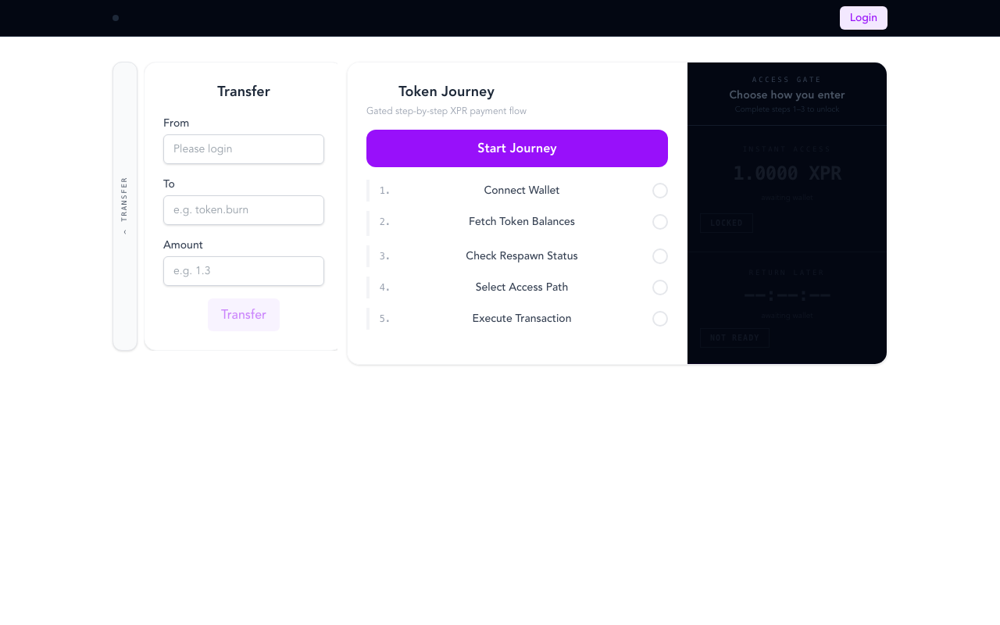
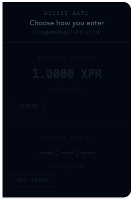
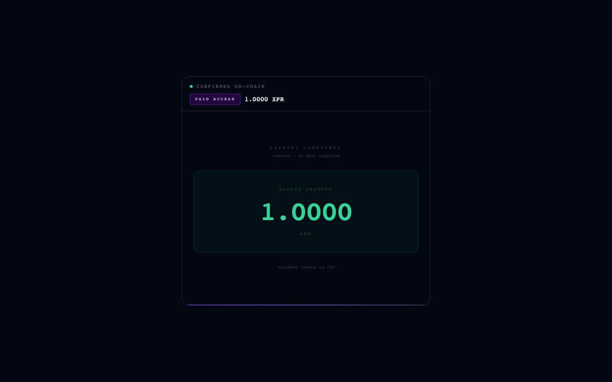
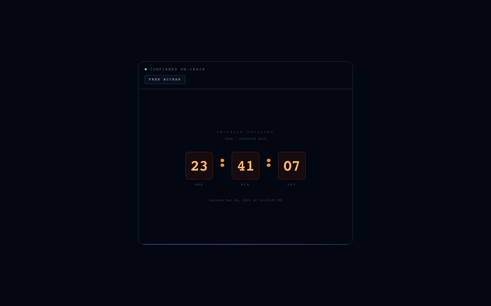

# Proton Web SDK

XPR Network wallet SDK for web apps — authentication, session management, transaction signing, and on-chain data queries. Includes `@proton/respawn`, a drop-in access gate that enforces on-chain cooldowns and converts users through time-pressure UX.

---

## Token Journey Demo


<details>
<summary><strong>Transfer tray + Vault Gate close-up</strong></summary>

| | |
|---|---|
|  |  |
| Transfer tray slides in from the left without displacing the journey | Vault Gate — dormant and dimmed until steps 1–3 complete. `1.0000 XPR` is always visible — the cost of instant access is never hidden |

</details>

<details>
<summary><strong>Post-selection — paid path · Access Granted</strong></summary>

Payment confirmed on-chain. No clock. The panel goes emerald — clean, immediate, final. The amount is echoed back as confirmation of what was exchanged.



</details>

<details>
<summary><strong>Post-selection — free path · Countdown running</strong></summary>

Free access recorded. The 24-hour cooldown clock starts immediately. Orange segmented digits. Blinking colons. An unlock timestamp. Every second visible is a second of pressure — a persistent reminder that paying would have skipped all of this.



</details>

---

## The Problem

Hard paywalls turn users away. Free tiers with no friction convert nobody. **Time-gated, token-backed access** solves this at the protocol level.

Every user gets one free entry per window (default 24h). After that: pay to skip the wait, or watch a live countdown clock drain in real time. No backend to game. No admin panel to bypass. The contract is the gatekeeper.

<details>
<summary><strong>The psychology — why a clock converts</strong></summary>

A dollar amount in isolation is easy to dismiss. But `23:41:07` next to `1.0000 XPR` reframes the question entirely. You are no longer deciding if a thing is worth a dollar — you are deciding whether the next 23 hours of your life are worth one.

**Loss aversion does the work.** We feel the pain of waiting far more acutely than we feel the pleasure of saving money. The clock makes that loss visceral, second by second, in front of the user exactly when they have demonstrated intent.

**Key principles:**
- Irreversibility creates commitment — on-chain choices feel real because they are
- Friction is a filter, not a failure — it surfaces high-intent users and discards the rest
- The free path must feel costly — a painless wait destroys the conversion case for paying
- Paying must feel like relief — emerald "Access Granted", clean, immediate, final
- On-chain enforcement is a trust signal — the contract cannot be gamed or reset

</details>

---

## Packages

| Package | Description |
|---|---|
| [`@proton/web-sdk`](packages/proton-web-sdk) | Core SDK — wallet connection, session restore, signing |
| [`@proton/link`](packages/proton-link) | Low-level link protocol and session management |
| [`@proton/browser-transport`](packages/proton-browser-transport) | Browser modal UI for wallet selection |
| [`@proton/respawn`](packages/proton-respawn) | On-chain access gate with cooldown + pay-or-wait flow |

---

## Quick Start

```bash
nvm use          # Node 18.19.1 (.nvmrc)
corepack enable  # enables pnpm
pnpm install
pnpm run build
cd examples/react && pnpm dev   # → http://localhost:5173
```

Set `DEMO_MODE = true` in [TokenJourney.tsx](examples/react/src/components/TokenJourney.tsx) to run the full journey without deployed contracts.

---

## Core SDK

```typescript
import ProtonWebSDK from '@proton/web-sdk'

const { link, session } = await ProtonWebSDK({
  linkOptions:      { endpoints: ['https://proton.eosusa.io'], restoreSession: false },
  transportOptions: { requestAccount: 'myapp' },
  selectorOptions:  { appName: 'My App', appLogo: 'https://myapp.com/logo.png' }
})

// Sign a transaction
await session.transact({
  actions: [{
    account: 'eosio.token', name: 'transfer',
    data: { from: session.auth.actor, to: 'recipient', quantity: '1.0000 XPR', memo: '' },
    authorization: [session.auth]
  }]
}, { broadcast: true })
```

---

## @proton/respawn

```typescript
import { checkRespawnStatus, recordFreeAccess, payForAccess } from '@proton/respawn'

const config = {
  accessContract: 'myapp.access', accessTable: 'accounts', accessAction: 'setaccess',
  paymentContract: 'myapp.pay',   paymentAction: 'unlock',
  paymentAmount: '1.0000 XPR',   cooldownHours: 24,
}

const status = await checkRespawnStatus(session, config)
// status.canRespawnFree  — cooldown expired
// status.timeRemainingMs — ms until free access
// status.hasEnoughXpr    — balance >= paymentAmount

await recordFreeAccess(session, config)  // record free entry
await payForAccess(session, config)      // pay to skip cooldown
```

<details>
<summary><strong>Expected on-chain table shape</strong></summary>

```
table:  'accounts'
scope:  <contract account>
fields: { account: name, last_access: uint32 }   // unix seconds
```

</details>

---

## Monorepo

```
packages/
  proton-web-sdk/           @proton/web-sdk
  proton-link/              @proton/link
  proton-browser-transport/ @proton/browser-transport
  proton-respawn/           @proton/respawn
examples/
  react/                    Token Journey demo
  svelte/ vue/ angular/ vanilla-html/
```

```bash
pnpm run build              # build all packages
pnpm run publish-packages   # publish to npm
```

---

[XPR Network](https://xprnetwork.org) · [Block Explorer](https://protonscan.io) · [Issues](https://github.com/XPRNetwork/proton-web-sdk/issues)
